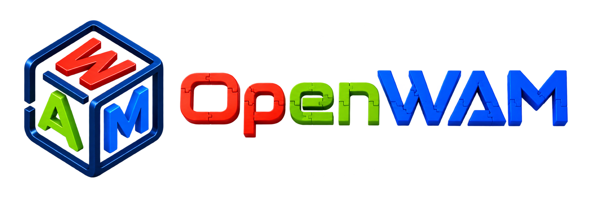

  

<h3 align="center">
  An Open, Modular Exploration Towards Systematic World–Action Model Pretraining
</h3>

  
  
  

  

  This repository is the project page. The model, code and data live behind the links above.

